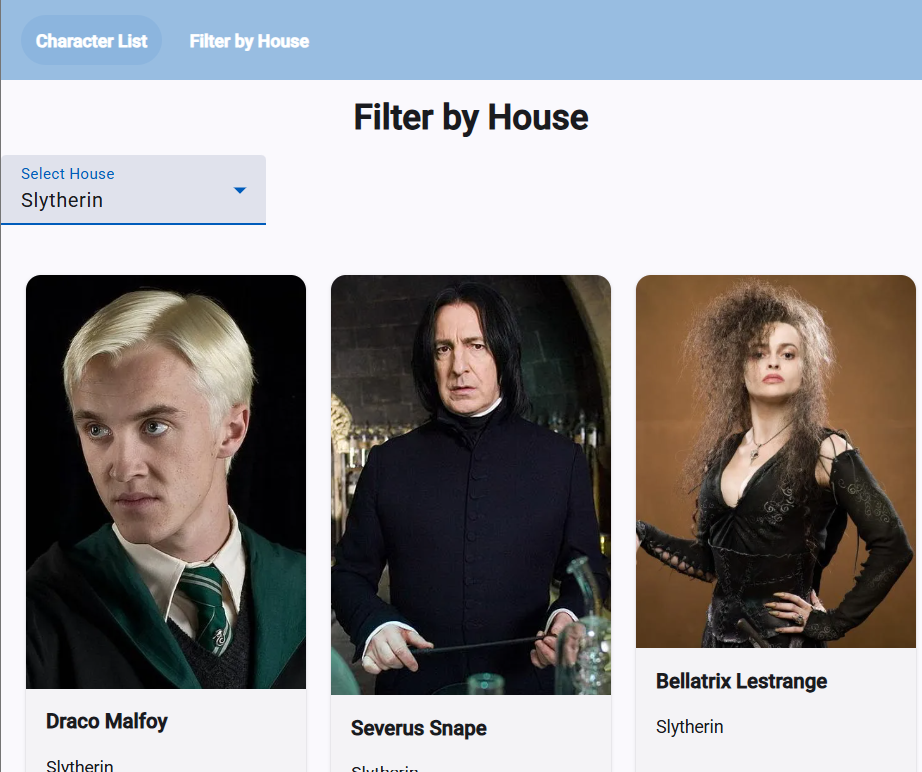
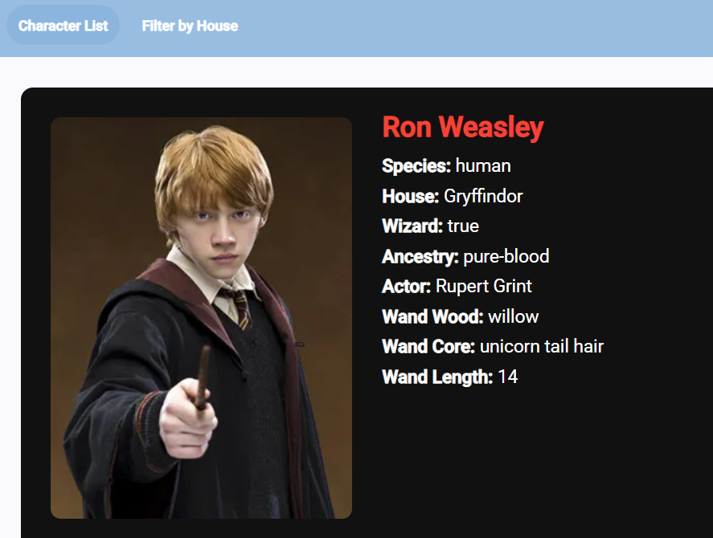

# Harry Potter

## Description
This project is an Angular application that displays Harry Potter characters using a public API. Users can view all characters, filter them by house, and see detailed information about each character.

## Features
- View all Harry Potter characters
- Filter characters by house (Gryffindor, Slytherin, Hufflepuff, Ravenclaw)
- View detailed information about each character
- Uses Angular HttpClient to fetch data from API
- Uses Angular Material for UI components

## Technologies Used
- Angular
- TypeScript
- Angular Material
- HTML / CSS
- Harry Potter API (https://hp-api.onrender.com/)

## Screenshots

### Character List Page

### Filter by House Page

### Character Details Page

